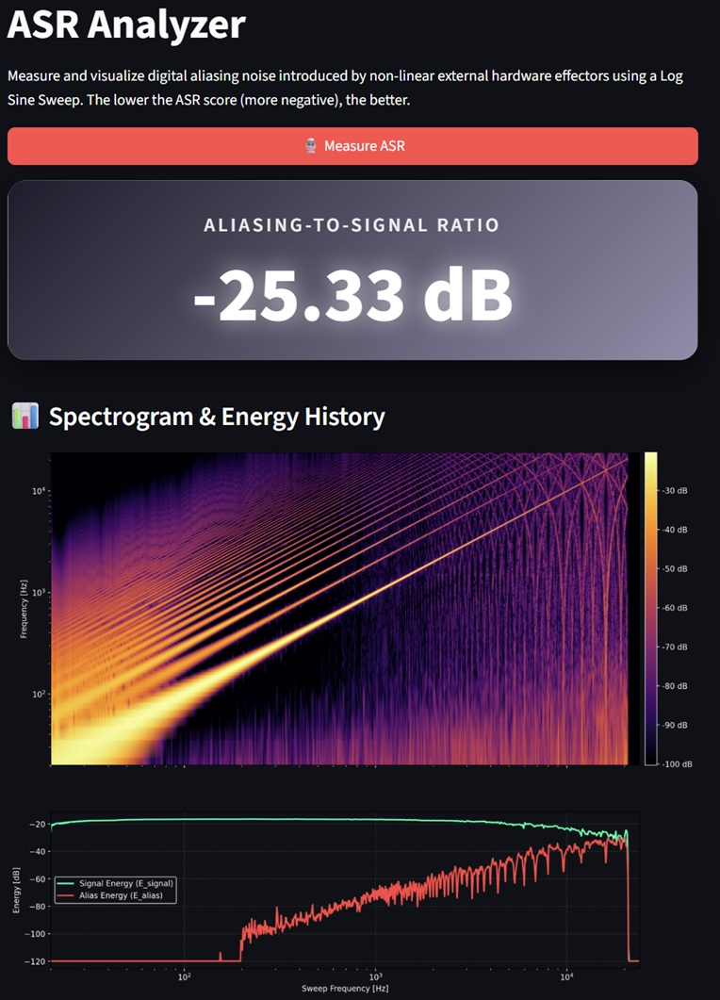
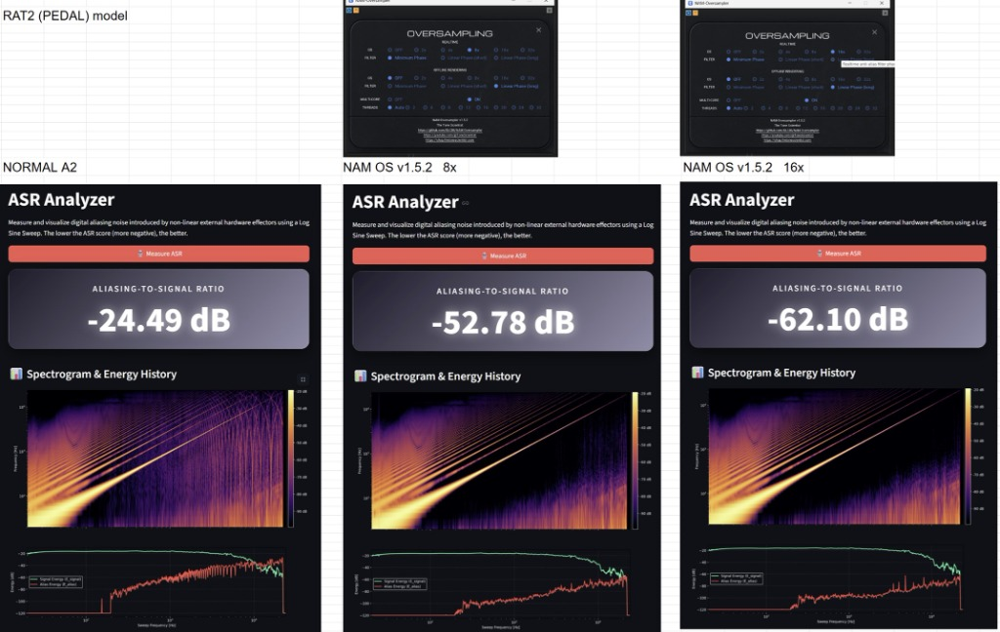

# NAM ASR Analyzer

A custom script designed to measure and visualize the **Aliasing-to-Signal Ratio (ASR)** in non-linear digital audio processors (such as Neural Amp Modeler) using the Log Sine Sweep method.

## 🛠️ Technical Features & Implementation Details

* **Dynamic Spectral Estimation:** Unlike fixed-window analysis, this script implements a dynamic spectrum estimation approach tailored for high-frequency resolution during fast frequency sweeps.
* **Lower Frequency Optimization (200Hz High-Pass):** In the ASR energy history (the bottom graph), frequencies below **200Hz are intentionally excluded** from the accumulation. 
    * *Rationale:* At very low frequencies, the wavelength exceeds the window length of the short-time Fourier transform (STFT), introducing windowing artifacts and leakage errors. Excluding this range ensures the calculated ASR score strictly reflects the audible, high-frequency aliasing noise that compromises audio quality.
* **Aliasing vs. Harmonics Discrimination:** The algorithm precisely differentiates between legitimate non-linear harmonics (moving upward in the spectrogram) and unharmonious aliasing products (reversing directions at the Nyquist frequency) based on their mathematical trajectories.

---

## 📊 Analysis Examples

Below is a typical analysis result generated by this analyzer (`screenshot.jpg`):



1.  **Overall ASR Score:** Displays the quantified Aliasing-to-Signal Ratio (e.g., `-25.33 dB`). The lower (more negative) the score, the cleaner the digital processing.
2.  **Spectrogram & Energy History:** Visualizes the sweep path. You can clearly observe the primary signal harmonics and the intersecting diagonal lines indicating prominent aliasing.
3.  **Energy History (Bottom Graph):** Differentiates *Signal Energy* (Green line) from the accumulated *Alias Energy* (Red line) over the course of the sweep.

---

## 🔬 Experimental Reference (Verification of NAM-Oversampler)

This analyzer was successfully utilized to verify the performance of [NAM-Oversampler v1.5.2](https://github.com/DLC86/NAM-Oversampler) (by Carmelo Di Lio / DLC86), showing a direct correlation between the oversampling factor and ASR improvement:

| Verification Stage | ASR Score | Visual Characterization |
| :--- | :---: | :--- |
| Normal NAM A2 (1x) | -24.49 dB | Severe aliasing lines intersecting the main signal. |
| NAM OS v1.5.2 (8x, Minimum Phase) | -52.78 dB | Aliasing lines are suppressed into the background. |
| NAM OS v1.5.2 (16x, Minimum Phase) | **-62.10 dB** | Further improvement and suppression compared to 8x. |



---

## 📚 Acknowledgments & References

The core concept and definition of the **Aliasing-to-Signal Ratio (ASR)** used in this script are heavily inspired by and based on the pioneering research in the following paper:

* **Paper:** *“Prediction of Aliasing Distortion in Digital Non-linear Audio Effects”*
* **Authors:** Balázs Bank and Stefano D'Angelo
* **Link:** [Available via ResearchGate](https://www.researchgate.net/publication/308381812_Prediction_of_aliasing_distortion_in_digital_non-linear_audio_effects)

We would like to express our deepest gratitude to the authors for their invaluable contribution to the field of digital audio signal processing, which made the quantification of this analyzer possible.

---

## ☕ Support the Project
Please consider supporting my ongoing verification projects via the **Buy Me a Coffee** link located in the **About section on the right sidebar** of this repository.

---

## ⚙️ How to Run
```bash
# Install dependencies
pip install streamlit numpy scipy sounddevice matplotlib pandas

# Run the app
streamlit run app.py
```
